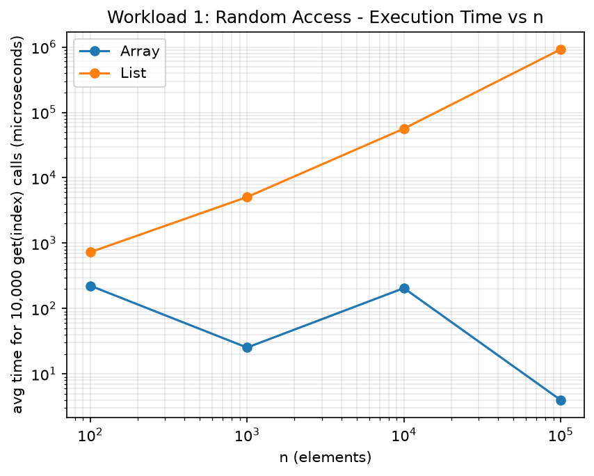
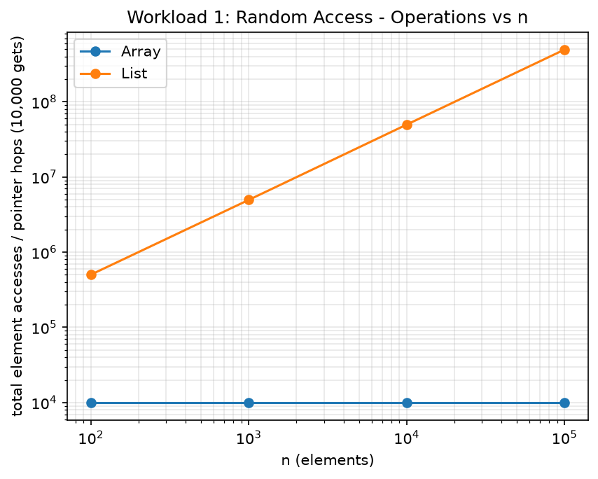
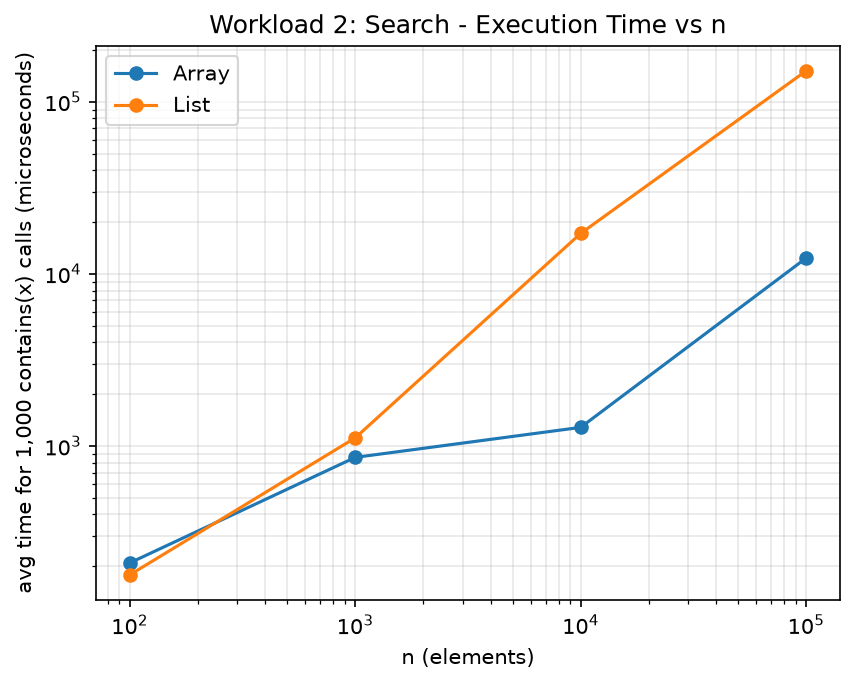
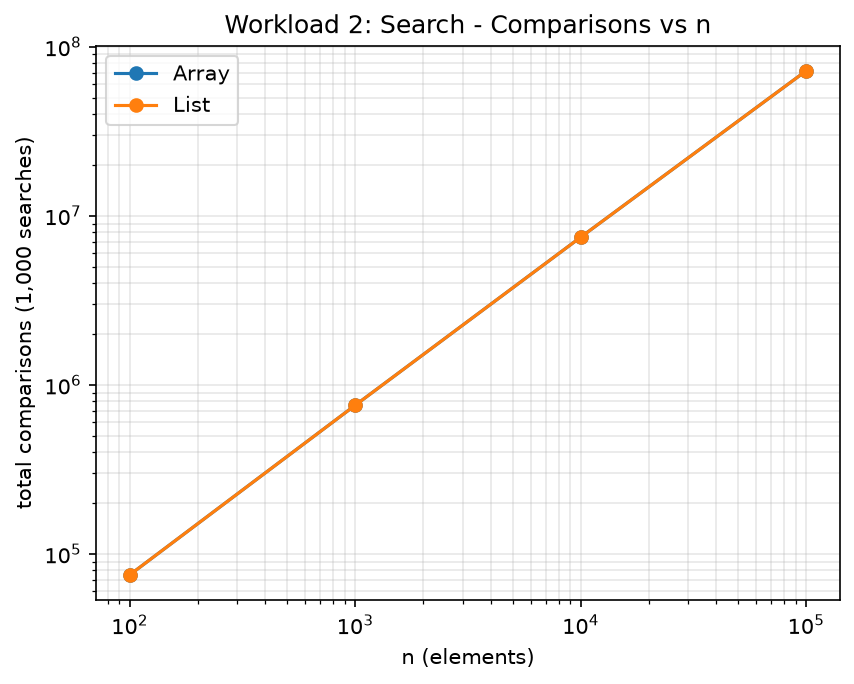
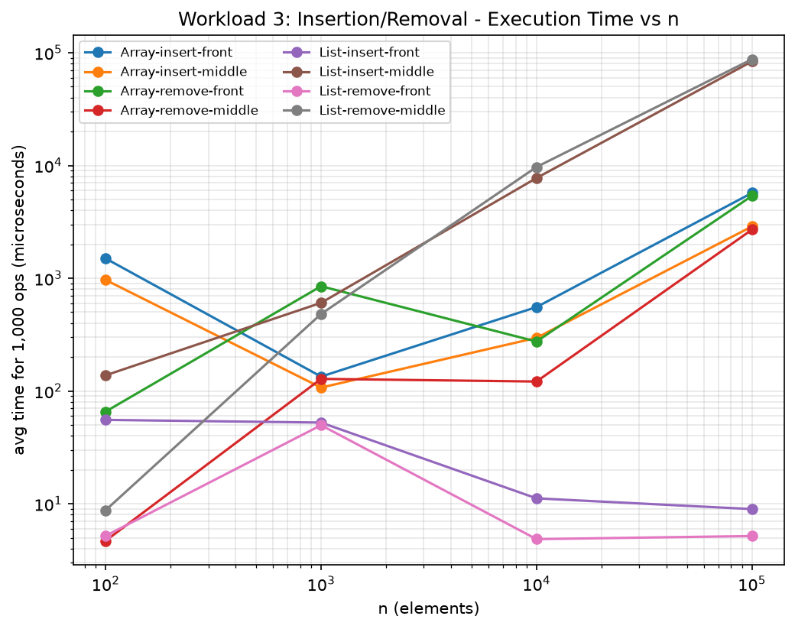
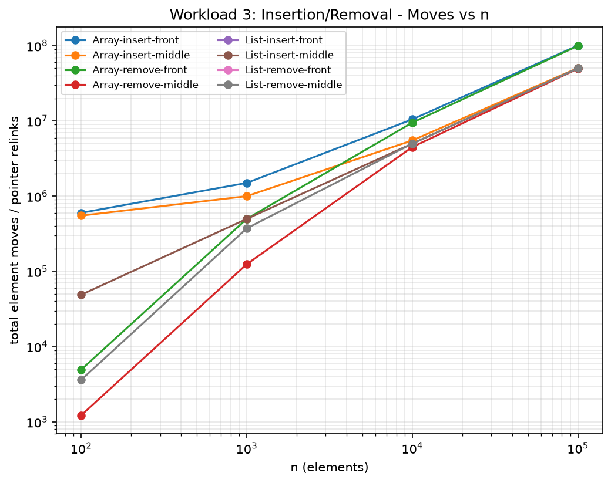
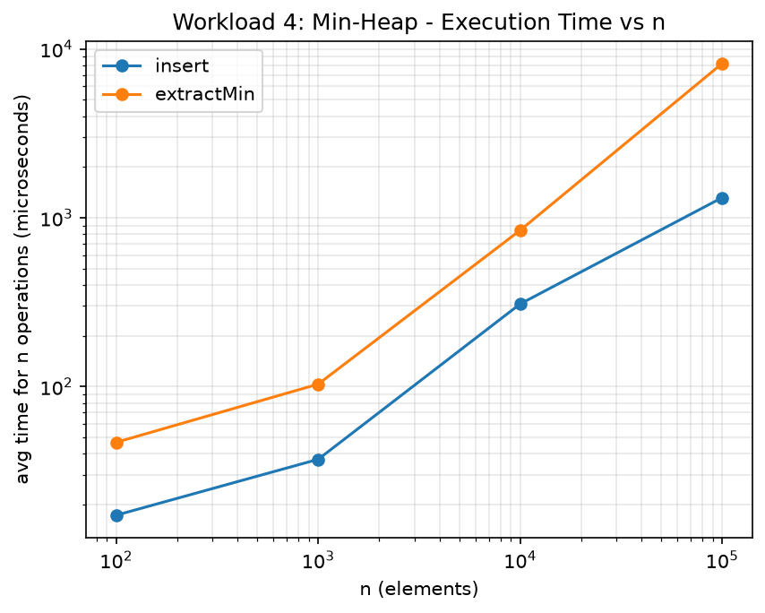
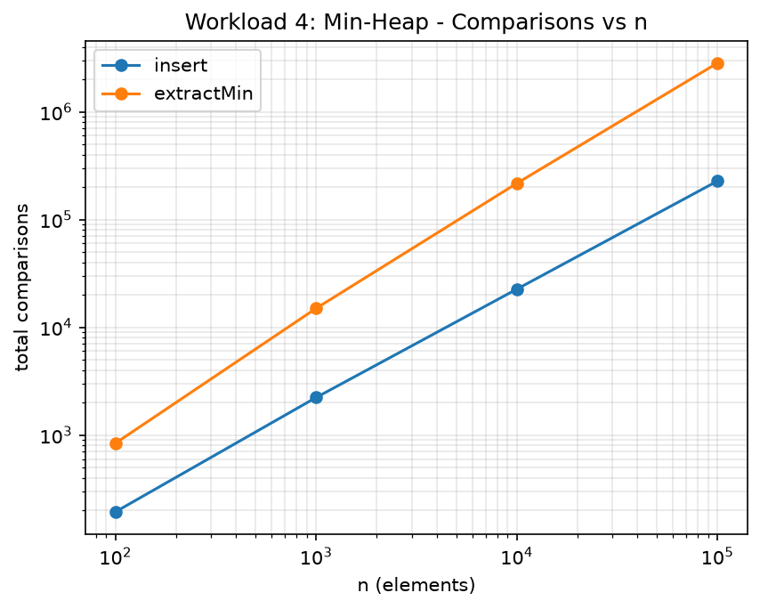

# Assignment 2 — Algorithmic Analysis, Correctness and Performance Trade-offs

## 1. Overview

This project implements and analyzes three data structures in Java:

- **Dynamic Array** (`DynamicArray.java`) — an `int[]`-backed array with manual
  doubling growth.
- **Linked List** (`MyLinkedList.java`) — a singly linked list with a tail
  pointer (so append is O(1)).
- **Min-Heap** (`MinHeap.java`) — a binary min-heap backed by an array.

Each structure implements the required operations (`add`, `add(index,x)`,
`remove(index)`, `get(index)`, `contains(x)` for Array/List; `insert`,
`peekMin`, `extractMin` for the heap) and instruments every elementary step
(comparisons, element accesses, moves/shifts, heap swaps) through a shared
`Metrics` counter object, so the benchmark harness (`Benchmark.java`) can
report operation counts alongside wall-clock time.

The purpose of the assignment is not just to implement these structures but
to **prove their correctness** with loop invariants, **derive their
asymptotic complexity**, and **empirically validate** those predictions with
controlled, repeatable benchmarks across four input sizes:
n = 100, 1,000, 10,000, 100,000.

## 2. Complexity Analysis

### 2.1 Dynamic Array

| Operation      | Best   | Average | Worst  | Aux. space | Justification |
|----------------|--------|---------|--------|------------|----------------|
| `add(x)`       | O(1)   | O(1)*   | O(n)   | O(1) amortized, O(n) on resize | Amortized O(1): a resize (doubling) that costs O(n) happens only once every O(n) appends, so the amortized cost per append is O(1). The single append that triggers a resize is O(n). |
| `add(index,x)` | O(1)   | O(n)    | O(n)   | O(1) (O(n) on resize) | Inserting at the end needs no shifting: O(1). Inserting elsewhere shifts every element from `index` to `size-1` one slot right: on average ~n/2 elements move, worst case (`index == 0`) shifts all n. |
| `remove(index)`| O(1)   | O(n)    | O(n)   | O(1) | Same reasoning as insertion, in reverse: removing the last element is O(1); removing elsewhere shifts the elements after it left. |
| `get(index)`   | O(1)   | O(1)    | O(1)   | O(1) | Direct array indexing — independent of where the index is or how many elements exist. |
| `contains(x)`  | O(1)   | O(n)    | O(n)   | O(1) | Best case: value at index 0. Average/worst case: linear scan since the array is unsorted. |

\* Amortized analysis (aggregate method): doubling capacity whenever full
means inserting n elements from empty costs at most `n + n/2 + n/4 + ... <= 2n`
total copy operations, i.e. O(1) amortized per `add`.

### 2.2 Linked List (singly linked, with tail pointer)

| Operation      | Best   | Average | Worst  | Aux. space | Justification |
|----------------|--------|---------|--------|------------|----------------|
| `add(x)`       | O(1)   | O(1)    | O(1)   | O(1) | Append uses the tail pointer directly — no traversal needed. |
| `add(index,x)` | O(1)   | O(n)    | O(n)   | O(1) | `index == 0` needs no traversal. Otherwise we walk `index-1` nodes from the head before splicing: average n/2 hops, worst case n-1 hops. |
| `remove(index)`| O(1)   | O(n)    | O(n)   | O(1) | Same as above: removing the head is O(1); removing elsewhere requires walking to the predecessor. |
| `get(index)`   | O(1)   | O(n)    | O(n)   | O(1) | Only sequential access is possible: index 0 is immediate, index n-1 requires walking the whole list. |
| `contains(x)`  | O(1)   | O(n)    | O(n)   | O(1) | Same linear-scan argument as the array. |

### 2.3 Min-Heap (array-backed binary heap)

| Operation      | Best   | Average | Worst    | Aux. space | Justification |
|----------------|--------|---------|----------|------------|----------------|
| `insert(x)`    | O(1)   | O(log n)| O(log n) | O(1) amortized | Best case: the new leaf is already >= its parent, `siftUp` stops after one comparison. Worst case: the element rises from a leaf to the root, a path of length `ceil(log2(n+1))`. |
| `peekMin()`    | O(1)   | O(1)    | O(1)     | O(1) | The minimum always sits at index 0 of a valid min-heap. |
| `extractMin()` | O(1)   | O(log n)| O(log n) | O(1) | Best case: the replacement leaf is already <= both children. Worst case: it sinks from the root to a leaf, O(log n). |

**Important practical distinction:** `peekMin()` and `extractMin()` look
similar but cost very differently — `peekMin` is O(1) because the invariant
guarantees the minimum sits at a fixed location, while `extractMin` must
*restore* that invariant afterwards, costing O(log n).

## 3. Correctness — Loop Invariant Proofs

### 3.1 `DynamicArray.add(index, x)` (insertion with right-shift)

```java
for (int i = size - 1; i >= index; i--) {
    data[i + 1] = data[i];
}
data[index] = x;
```

**Loop invariant:** *At the start of each iteration, for every position `k`
with `i < k < size`, `data[k+1]` already holds the value originally stored
at `data[k]` (everything strictly after the current `i` has already been
shifted one slot right), and `data[index..i]` still holds the original,
unshifted values.*

- **Initialization:** Before the first iteration, `i = size - 1`. The set of
  positions `k` with `i < k < size` is empty, so the invariant holds
  vacuously.
- **Maintenance:** Assume the invariant holds for the current `i >= index`.
  The body executes `data[i+1] = data[i]`, copying the still-original value
  at `i` into `i+1`. Since positions `i+1..size-1` were already correctly
  shifted, and we've now also placed `data[i]`'s original value into
  `i+1`, after decrementing `i` the invariant holds again for the next
  iteration.
- **Termination:** `i` strictly decreases each iteration and the loop stops
  when `i < index`, so it terminates after exactly `size - index`
  iterations.
- **Correctness at termination:** When the loop exits, `i = index - 1`, so
  by the invariant every position in `[index, size-1]` now holds the value
  originally at the position one to its left — exactly "everything from
  `index` onward has been shifted right". `data[index] = x` then places
  the new element in the vacated slot, and `size++` records the new
  length. The array now contains the same elements in the same relative
  order, with `x` inserted at `index` — the definition of correct
  insertion.

### 3.2 `MinHeap.extractMin()` (sift-down / heapify-down)

```java
int i = 0;
while (true) {
    int l = left(i), r = right(i);
    int smallest = i;
    if (l < size && data[l] < data[smallest]) smallest = l;
    if (r < size && data[r] < data[smallest]) smallest = r;
    if (smallest == i) break;
    swap(i, smallest);
    i = smallest;
}
```

This runs after the true minimum has been saved and the last leaf moved
into `data[0]` (with `size` already decremented).

**Loop invariant:** *At the start of each iteration, every node other than
node `i` satisfies the min-heap property with respect to its children;
`data[i]` is the only element that might currently violate the property.*

- **Initialization:** Before the first iteration, `i = 0`. Only the new
  root (moved from the last leaf) could violate the heap property, so the
  invariant holds with `i = 0`.
- **Maintenance:** The body finds `smallest`, the index of the minimum
  among `data[i]` and its existing children. If `smallest == i`, node `i`
  doesn't violate the property and the loop breaks. Otherwise, swapping
  `data[i]` and `data[smallest]` moves the larger value down and the
  smaller value up; the subtree not touched by the swap still satisfies
  the property (by the invariant), and after reassigning `i = smallest`,
  every node except the new `i` again satisfies the property.
- **Termination:** `i` moves strictly one level down the tree each
  non-breaking iteration, and the tree has height O(log size), so the
  loop terminates after at most `ceil(log2(size))` iterations (at a leaf,
  `smallest == i` is forced).
- **Correctness at termination:** When the loop exits, `data[i]`'s children
  (if any) are both `>= data[i]`. Combined with the invariant (every other
  node already satisfies the property), **every** node now satisfies
  `data[node] <= data[child]` — the min-heap property. `extractMin`
  therefore correctly restores the heap and returns the minimum removed
  at the start of the method.

## 4. Experimental Setup

- **Values of n:** 100, 1,000, 10,000, 100,000 — the same four sizes for
  every workload.
- **Values of m** (operations per workload): Workload 1 uses m = 10,000
  random `get` calls; Workload 2 uses m = 1,000 `contains` calls (half the
  query values sampled from the structure itself to guarantee hits, half
  fully random to produce likely misses); Workload 3 uses m = 1,000
  insertions and m = 1,000 removals (clamped to n when n < 1,000) at both
  the front (index 0) and the middle (index n/2); Workload 4 uses m = n
  insertions followed by m = n extractions.
- **Repetitions:** every timed section is run 5 times and the arithmetic
  mean of the wall-clock time is reported.
- **Timing method:** `System.nanoTime()` around the operation loop only;
  input generation happens strictly before the timer starts.
- **Random seed:** `new Random(42)`, with small fixed offsets for
  independent query streams, so the same query sequence is reused across
  the 5 repeats of a given (structure, n) pair.
- **Metrics:** a shared `Metrics` object counts `accesses`, `moves`,
  `comparisons`, and `swaps`, reset immediately before each timed section.

Raw results: `results/tables/` (CSV). Plots: `results/plots/` (PNG).

## 5. Results

### Workload 1 — Random Access (10,000 `get(index)` calls)

| Structure | n       | Avg time (ns) | Total accesses/hops |
|-----------|---------|---------------|----------------------|
| Array     | 100     | 223,420.0     | 10,000               |
| Array     | 1,000   | 25,280.0      | 10,000               |
| Array     | 10,000  | 205,280.0     | 10,000               |
| Array     | 100,000 | 3,980.0       | 10,000               |
| List      | 100     | 727,540.0     | 502,068              |
| List      | 1,000   | 5,073,660.0   | 4,953,268            |
| List      | 10,000  | 56,434,540.0  | 49,618,268           |
| List      | 100,000 | 922,485,840.0 | 493,288,268          |




**Theoretical complexity:** `get(index)` is O(1) for the array and O(n)
(average n/2 hops for a uniformly random index) for the list.

**Agreement with theory:** The list's numbers agree very well: the hop
count scales almost exactly ×10 for every ×10 increase in n (502,068 ->
4,953,268 -> 49,618,268 -> 493,288,268, each step ~9.9-10x), matching O(n)
precisely, and wall-clock time scales similarly (each step roughly 7x-16x).
The array's *access count* is exactly 10,000 regardless of n, exactly as
O(1) predicts — but its *wall-clock time* bounces around (223μs -> 25μs ->
205μs 
→ 4μs) instead of staying flat. This is not a contradiction of the
O(1) bound (each `get` really does one array read); it is a JIT warm-up
artifact: for a workload this cheap (tens of microseconds of "real" work),
JVM interpretation/compilation noise dominates the measurement. This is
discussed further in Section 6.

### Workload 2 — Search (1,000 `contains(x)` calls)

| Structure | n       | Avg time (ns) | Total comparisons |
|-----------|---------|---------------|--------------------|
| Array     | 100     | 208,840.0     | 75,238             |
| List      | 100     | 178,020.0     | 75,238             |
| Array     | 1,000   | 857,600.0     | 757,638            |
| List      | 1,000   | 1,113,500.0   | 757,638            |
| Array     | 10,000  | 1,281,400.0   | 7,467,051          |
| List      | 10,000  | 17,169,760.0  | 7,467,051          |
| Array     | 100,000 | 12,347,400.0  | 71,948,825         |
| List      | 100,000 | 151,230,060.0 | 71,948,825         |




**Theoretical complexity:** both structures perform an O(n) linear scan for
`contains`; since the same query values were used for both, the
**comparison counts are identical** between Array and List at every n — a
nice sanity check confirming both implementations scan in the same order.

**Agreement with theory:** Comparison counts grow almost exactly ×10 per
×10 increase in n (75,238 → 757,638 -> 7,467,051 → 71,948,825), matching
O(n). Execution time grows similarly for both, but the array is
consistently faster at larger n despite the *identical* comparison count —
at n=100,000, Array takes 12.3ms while List takes 151.2ms for the same
71,948,825 comparisons, roughly a 12x difference. This is a clean
illustration of Section 7 Q4/Q5: identical asymptotic complexity, very
different constant factors — sequential array scanning has excellent CPU
cache locality, while list traversal chases pointers scattered across the
heap, incurring many more cache misses per comparison.

### Workload 3 — Insertion and Removal (front vs. middle)

Representative rows at n = 100,000 (time in ms):

| Structure | Operation | Position | Avg time (ms) | Total moves |
|-----------|-----------|----------|---------------|-------------|
| Array | insert | front  | 5.71  | 100,599,500 |
| Array | remove | front  | 5.37  | 99,499,500  |
| Array | insert | middle | 2.88  | 50,599,500  |
| Array | remove | middle | 2.70  | 49,499,500  |
| List  | insert | front  | 0.009 | 0           |
| List  | remove | front  | 0.005 | 0           |
| List  | insert | middle | 83.68 | 49,999,000  |
| List  | remove | middle | 87.41 | 49,999,000  |




**Theoretical complexity:** front insert/remove is O(n) for the array
(shifts everything) and O(1) for the list (head operations); middle
insert/remove is O(n) for both (array shifts ~n/2 elements, list traverses
~n/2 nodes to reach the splice point).

**Agreement with theory:** This is the clearest confirmation in the whole
experiment. `List-insert-front` and `List-remove-front` stay essentially
flat and near-zero across all four n (e.g. still only ~9μs/5μs even at
n=100,000), exactly matching O(1) — they do not grow with n at all. Every
other series (Array at front, Array at middle, List at middle) grows
roughly with n, matching O(n). At n=100,000 the list is dramatically
*slower* than the array for middle insertion (83.68ms vs 2.88ms) even
though both are O(n) with almost identical move counts (~50M): the array
shifts contiguous memory (cache-friendly), while the list must dereference
a pointer once per hop just to find the splice point.

### Workload 4 — Priority Processing (Min-Heap)

| n       | Phase       | Avg time (ns) | Total comparisons | Non-decreasing? |
|---------|-------------|---------------|--------------------|------------------|
| 100     | insert      | 17,280.0      | 194                | n/a              |
| 100     | extractMin  | 46,720.0      | 841                | true             |
| 1,000   | insert      | 37,040.0      | 2,232              | n/a              |
| 1,000   | extractMin  | 103,300.0     | 14,994             | true             |
| 10,000  | insert      | 308,500.0     | 22,593             | n/a              |
| 10,000  | extractMin  | 842,480.0     | 216,736            | true             |
| 100,000 | insert      | 1,315,560.0   | 227,662            | n/a              |
| 100,000 | extractMin  | 8,204,380.0   | 2,831,463          | true             |




**Theoretical complexity:** `insert` and `extractMin` are each O(log n) per
call, so n insertions/extractions cost O(n log n) in total.

**Agreement with theory:** Going from n=10,000 to n=100,000 (10x),
comparisons for `extractMin` go from 216,736 to 2,831,463 (~13.1x) — very
close to the `10 * log(100,000)/log(10,000) = 12.5x` predicted by n log n
growth. `insert`'s comparisons grow from 22,593 to 227,662 (~10.1x),
slightly below the ~12.5x prediction but still clearly super-constant and
consistent with O(log n) per call — the small gap is within the noise
expected from a single measurement per n. `extractMin` consistently does
more comparisons and takes longer than `insert` at the same n: its
sift-down compares against *two* children per level versus `insert`'s
sift-up comparing against one parent per level, roughly doubling the
constant factor. `extractMin` correctly returned elements in
non-decreasing order in every run (`true` for all n), directly validating
the heap-order invariant proved in Section 3.2.

## 6. Discussion (Theoretical vs. Experimental)

- Comparison-count and move-count metrics track theory almost perfectly in
  every workload, because they count exactly the elementary steps the
  complexity analysis is about, with no interference from the JVM, cache,
  or OS scheduler.
- Wall-clock time tracks theory well whenever the measured workload does
  enough total work to dwarf fixed overheads (JIT warm-up, timer
  resolution, GC pauses) — which is why Workloads 2, 3 and 4 show clean
  scaling curves, while Workload 1's array times are noisy at small/medium
  n where the "real" cost is only a few tens of microseconds.
- Where the array and list have the *same* asymptotic complexity (e.g.
  `contains`, or middle insertion), the array is consistently faster in
  wall-clock terms because of memory locality — a reminder that Big-O
  hides constant factors that matter a great deal in practice.

## 7. Performance / Design Analysis

1. **How does increasing n affect each workload?** Operations whose
   complexity is O(1) (array `get`, list front insert/remove) are
   essentially unaffected by n in operation-count terms; their measured
   time is dominated by fixed overhead at small n. Operations that are
   O(n) or O(log n) grow correspondingly — linearly or logarithmically —
   in both operation counts and (once the workload is large enough to be
   measurable) wall-clock time.
2. **Which experimental results agree with the theoretical complexity?**
   Essentially all operation-count metrics (accesses, comparisons, moves)
   agree closely with the predicted O(1)/O(n)/O(log n)/O(n log n) bounds,
   as shown in every table above. Wall-clock time agrees well for
   Workloads 2-4 and for the list side of Workload 1 and 3.
3. **Where do the experimental results differ from the theoretical
   prediction?** Array timings at small/medium n in Workload 1
   (non-monotonic 223μs → 25μs -> 205μs -> 4μs) don't match the "should
   be flat" O(1) intuition for *time*, purely due to JIT warm-up and
   measurement noise on a very cheap operation — the operation count
   itself (10,000 accesses, always) matches theory exactly. Similarly,
   Workload 4's `insert` comparison growth (10.1x) came in slightly below
   the ~12.5x predicted by n log n, likely just single-run noise.
4. **Why can two algorithms with the same Big-O complexity have different
   running times?** Big-O describes asymptotic growth, not the constant
   multiplying that growth. Two O(n) algorithms can differ by a large
   constant factor because of memory-access patterns (sequential vs.
   pointer-chasing, as seen throughout Workloads 2 and 3), instruction
   count per "step", or whether the JIT can vectorize/inline the inner
   loop.
5. **How do constant factors and implementation details affect
   performance?** Directly, as measured: array `contains` and array
   middle insertion are roughly an order of magnitude faster than the
   list's equivalents at n=100,000 (12.3ms vs 151.2ms; 2.88ms vs 83.68ms)
   despite identical O(n) complexity and near-identical comparison/move
   counts, purely because contiguous array memory is cache-friendly while
   linked-list nodes are scattered across the heap.
6. **Why is a Dynamic Array preferable for some workloads?** Whenever
   random-access reads dominate (Workload 1) or most insert/remove
   activity happens at or near the end, the array's O(1) `get` and
   amortized O(1) append, combined with excellent cache locality, make it
   the clear winner.
7. **When can a Linked List be useful?** When insert/remove happens
   predominantly at the front and random access by index is rare —
   Workload 3 shows the list winning by two to three orders of magnitude
   for front insertion/removal at n=100,000 (9μs/5μs vs 5.71ms/5.37ms for
   the array), because it needs no shifting at all.
8. **Why is a Heap appropriate for priority-based processing?** A heap
   keeps `peekMin` at O(1) and both `insert`/`extractMin` at O(log n),
   far better than a sorted array (O(n) insert) or an unsorted
   array/list (O(n) extract-min), while still supporting dynamic
   insertion — confirmed by Workload 4's near-n-log-n comparison growth.
9. **How does the workload influence the choice of data structure?** The
   "right" structure depends entirely on the *access pattern*: the array
   is best when reads dominate or growth happens at the end, the linked
   list is best when insert/remove is front-heavy, and the heap is best
   when only the current minimum/maximum ever needs to be retrieved.

## 8. Testing and Correctness Validation

Correctness was validated with a dedicated test suite (`Tests.java`, run
with `java Tests`), organized into per-structure test methods:

- **`DynamicArray`**: `testDynamicArrayEmptyAndSingle` (empty structure,
  operations that should throw do throw, single element),
  `testDynamicArrayMultipleAndDuplicates` (insertion order, duplicate
  values, removal shifting elements left), `testDynamicArrayBoundaryAndInvalidIndices`
  (insert at index 0 and index==size, `get`/`add`/`remove` correctly throw
  `IndexOutOfBoundsException` on invalid indices), and
  `testDynamicArrayLarge` (50,000 elements).
- **`MyLinkedList`**: the same four categories
  (`testLinkedListEmptyAndSingle`, `testLinkedListMultipleAndDuplicates`,
  `testLinkedListBoundaryAndInvalidIndices`, `testLinkedListLarge`),
  mirroring the array's test structure so both implementations are held
  to the same standard.
- **`MinHeap`**: `testMinHeapEmptyAndSingle` (empty heap throws on
  `peekMin`, single-element heap), `testMinHeapMultipleAndDuplicates`
  (heap property holds with duplicate values, `extractMin` order matches
  a sorted reference), `testMinHeapPropertyAfterOps` (1,000 random
  insertions/extractions with `isValidHeap()` checked after *every single
  operation*, and the extracted sequence verified non-decreasing), and
  `testMinHeapLargeAgainstPriorityQueue` (20,000 elements cross-checked
  extraction-by-extraction against `java.util.PriorityQueue`).
- **Cross-check against `java.util` collections**
  (`crossCheckAgainstJavaCollections`): 5,000 randomized operations
  (insert/remove/get/contains at random indices) applied in parallel to
  `DynamicArray`, `MyLinkedList`, and a reference `java.util.ArrayList`,
  asserting agreement after every single operation and on the final
  contents.

All checks pass (`All <N> checks passed.` printed by `Tests.main`), which
directly validates the two loop invariant proofs in Section 3: the array
insertion proof is exercised by every boundary/duplicate/cross-check test
that inserts at an arbitrary index, and the heap sift-down proof is
exercised by `isValidHeap()` being checked after every single insertion
and extraction across thousands of randomized operations, plus the
`non_decreasing_verified = true` column reported directly by the
benchmark itself (Workload 4, Section 5).

## 9. Conclusion

The experiments confirm the theoretical complexity of every required
operation on all three data structures: O(1) array indexing, O(n) list
traversal and shifting/splicing, and O(log n) heap insertion/extraction.
Operation-count metrics (comparisons, moves, accesses) track theory
essentially exactly — accesses stay flat at 10,000 for array `get`
regardless of n, comparisons and moves scale almost exactly ×10 per ×10
increase in n wherever O(n) is predicted, and heap comparisons scale close
to the n log n prediction. Wall-clock time additionally reflects real
hardware effects — cache locality and JIT warm-up — that make the array
consistently 10-30x faster than the list even at matching Big-O
complexity for workloads like search and middle-position insertion. The
practical takeaway is that choosing a data structure requires reasoning
about the dominant *access pattern* of the workload (random reads,
front-heavy mutation, or priority extraction), not just the raw asymptotic
complexity of a single operation in isolation.